  

  
  

  Software engineer and gameplay programmer building Unreal Engine C++ systems, React/TypeScript tools, and interactive portfolio demos.

  

 

  <strong>
    About
  </strong>

  

- Software engineer with a B.S. in Computer Science from Full Sail University.
- Focused on gameplay systems, tools, UI workflows, runtime validation, debugging, and technical documentation.
- Recent portfolio work uses Unreal Engine 5.8 C++, reusable plugin architecture, mission/objective systems, HUD feedback, event logging, and report-style interfaces.
- Also building React/TypeScript tooling with typed data contracts, local workflow persistence, validation, and maintainable UI architecture.

 

  <strong>Featured Projects</strong>

  

| Project | Stack | Focus |
| --- | --- | --- |
| [Mission Systems Lab](https://github.com/Zoruahful/MissionSystemsLab) | Unreal Engine 5.8, C++ | Data-driven mission flow, objective markers, HUD feedback, JSON parsing, runtime state, structured event logging |
| [Scenario Operations Console](https://github.com/Zoruahful/ScenarioOperationsConsole) | Unreal Engine 5.8, C++ | Reusable plugin integration, scenario validation, operator HUD, event feed, warning acknowledgement, report generation |

BattleLab and Mission Debrief Pipeline will be featured when they reach their next public release milestones.

 

  <strong>Tech Stack</strong>

  

**Core Languages**

**Game And Interactive Systems**

**Frontend And UI**

**Workflow**

  

Building interactive systems that are small enough to inspect, clear enough to play, and structured enough to extend.
